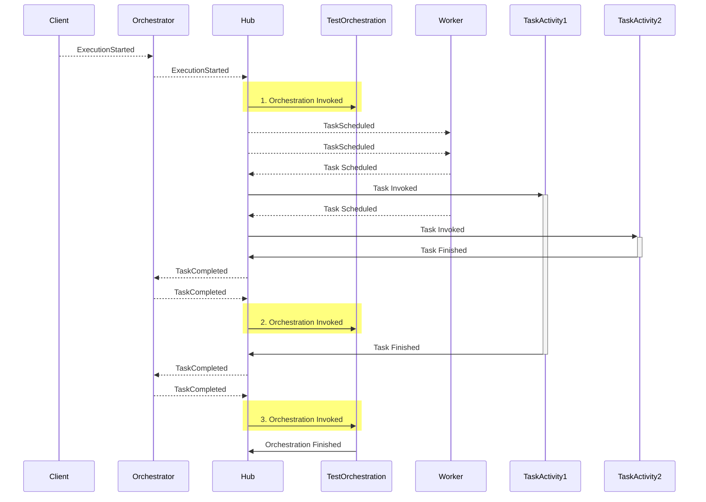

### Durable Task Framework Series
This is part 2 of a series of posts on DTF.
1. [Durable Task Framework Internals - Part 1 (Dataflow and Reliability)](https://abhikmitra.github.io/blog/durable-task/)
2. [Durable Task Framework Internals - Part 1 (The curious case of Orchestrations)](https://abhikmitra.github.io/blog/durable-task-2/)

---
 
### Multi Activity Orchestrations

We will see whats the process how the Orchestration works in case of multiple activities as thats what you will generally have.

1. Happy Path - with 2 Orchestrations


2. *The curious case of Orchestrations* - So we have  the same Orchestration getting invoked 3 times. Curiously only once the orchestration finishes while others dont seem to do anything.
Lets look at the orchestration code.
```C#

    Console.Writeline("Orchestration Started");
    var task1 = context.ScheduleWithRetry<bool>(typeof(TestActivity1), options, "Test Input1");
    var task2 = context.ScheduleWithRetry<bool>(typeof(TestActivity2), options, "Test Input2");

    var result1 =  await task1;
    var result2 = await task2;
    Console.Writeline("Orchestration Finished");
    return result;
```
    - **First** time Orchestration starts - Replay False - Starts due to TaskCompleted event from client
        - Console logs - Orchestration Started
        - Encounters 2 ScheduleWithRetry and sends 2 taskScheduled event to the Worker
        - Goes to the await statement, see that task 1 is not complete. Exits.
    - **Second** time orchestration starts - Replay true - Starts due to TaskCompleted event from Task 2 getting completed
        - Console logs - Orchestration Started
        - Encounters 2 ScheduleWithRetry which basically does a noop as the tasks are already scheduled.
        - Goes to the await statement, see that task 1 is not complete. Exits.
    - **Third time** orchestration starts - Replay true - Starts due to TaskCompleted event from Task 1 getting completed
        - Console logs - Orchestration Started
        - Encounters 2 ScheduleWithRetry which basically does a noop as the tasks are already scheduled.
        - Goes to the await statement, see that task 1 complete, returns the result.
        - Goes to the await statement, see that the task 2 is already complete, returns the result.
        - Console logs - Orchestration Finished
3. So in general for any orchestration we will have n number of unfinished Orchestrations and one finished orchestration.

4. Unfinished Orchestrations - The orchestrations seem to magically dissapear after they encounter  i.e. if Task1 is in flight.
```
   var result1 =  await task1;
```
    - In Case #1 and case #2 , this await never returns because internally when you Schedule a task it cannot invoke the actual task due to the sync nature of execution.
    - Instead the framework returns a [TaskCompletionSource](https://docs.microsoft.com/en-us/dotnet/api/system.threading.tasks.taskcompletionsource-1?view=netframework-4.8).
    - The framework checks the Service Bus message (TaskCompleted event) which triggered the execution whether it has the result of the await call and resolves the `TaskCompletionSource`
    - In all other cases `TaskCompletionSource` is never resolved and hence you get the `Orchestration Finished` log only once and not in the other 2 cases.
    - This of course does not mean that the thread is blocked. The task parallel library will free up the thread and recyle it back to the pool.
5. The await that you do over the `ScheduleWithRetry` Tasks are actually a syntactic sugar over what is primarily an asynchronous event driven system based on Queues.