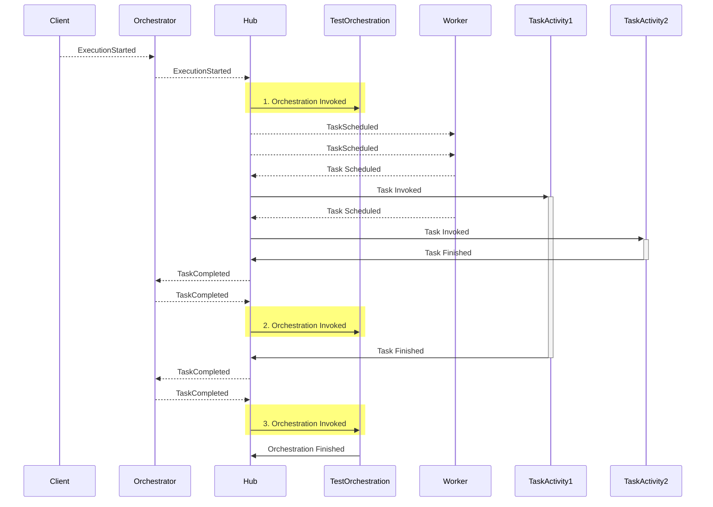
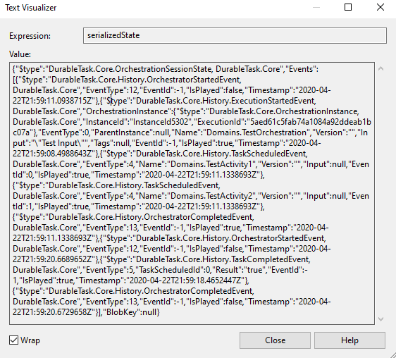

### Durable Task Framework Series
This post is **part 2** of a series of posts on DTF.
1. [Durable Task Framework Internals - Part 1 (Dataflow and Reliability)](https://abhikmitra.github.io/blog/durable-task/)
2. [Durable Task Framework Internals - Part 2 (The curious case of Orchestrations)](https://abhikmitra.github.io/blog/durable-task-2/)
3. [Durable Task Framework Internals - Part 3 (Tracker Queue, Instance History, and JumpStart)](https://abhikmitra.github.io/blog/durable-task-3/)
4. [Durable Task Framework Internals - Part 4 (Terminated Orchestrations & Middlewares)](https://abhikmitra.github.io/blog/durable-task-4/)

Do you think there is more that I should cover or something I should fix ? Please raise an [issue](https://github.com/abhikmitra/blog/issues) and let me know

---
 
### Multi Activity Orchestrations

We will see whats the process of  Orchestration in case of multiple activities as that's what you will frequently have.

Here is a sequence diagram of the happy path with an orchestration comprising of two activitties `TaskActivity1` and `TaskActivity2`


### The curious case of Orchestrations 
So we have  the same Orchestration getting invoked 3 times. Curiously only once the orchestration finishes while others dont seem to do anything.
Lets look at the orchestration code.
```csharp

    Console.Writeline("Orchestration Started");
    var task1 = context.ScheduleWithRetry<bool>(typeof(TestActivity1), options, "Test Input1");
    var task2 = context.ScheduleWithRetry<bool>(typeof(TestActivity2), options, "Test Input2");

    var result1 =  await task1;
    var result2 = await task2;
    Console.Writeline("Orchestration Finished");
    return result;
```

- **First** time Orchestration starts - Replay False - Starts due to TaskCompleted event from the client
    - Console logs - Orchestration Started
    - Encounters 2 ScheduleWithRetry and sends two taskScheduled event to the Worker
    - Goes to the await statement, see that task 1 is not complete. Exits.
- **Second** time orchestration starts - Replay true - Starts due to TaskCompleted event from Task 2 getting completed
    - Console logs - Orchestration Started
    - Encounters 2 ScheduleWithRetry, which does a noop as the tasks are already scheduled.
    - Goes to the await statement, see that task 1 is not complete. Exits.
- **Third time** orchestration starts - Replay true - Starts due to TaskCompleted event from Task 1 getting completed
    - Console logs - Orchestration Started
    - Encounters 2 ScheduleWithRetry, which does a noop as the tasks are already scheduled.
    - Goes to the await statement, sees that task 1 complete, returns the result.
    - Goes to the await statement, sees that task 2 is already complete, returns the result.
    - Console logs - Orchestration Finished

So, in general, for any orchestration, we will have n number of unfinished Orchestrations and one complete orchestration.

### Incomplete Orchestrations

The orchestrations seem to magically disappear after they encounter `await`, i.e. if Task1 is in flight.
```
   var result1 =  await task1;
```

- In Case #1 and case #2 , this `await` never returns because internally when you Schedule a task it cannot invoke the actual task due to the sync nature of execution.
- Instead the framework returns a [TaskCompletionSource](https://docs.microsoft.com/en-us/dotnet/api/system.threading.tasks.taskcompletionsource-1?view=netframework-4.8).
- The framework checks the Service Bus message (TaskCompleted event) which triggered the execution whether it has the result of the await call and resolves the `TaskCompletionSource`
- In all other cases `TaskCompletionSource` is never resolved, and hence you get the `Orchestration Finished` log only once and not in the other 2 cases.
- Unfulfilled tasks does not mean that the thread is blocked. The task parallel library will free up the thread and recycle it back to the pool.

> The await that you do over the `ScheduleWithRetry` Tasks are syntactic sugar over what is primarily an asynchronous event-driven architecture based on Queues.

## Where do results from taskActivity get stored ?

In Part 1, you would have seen that even though hub was shut down , if the Task  execution was complete it will not re-run the Task. Its a similar situation when task1 completes in the multi activity scenario above , orchestration gets executed multiple times and gets the value of Task2 without even executing it more than once. Surely there is some store where the result from the task activities are stored?

- DTF serializes all the events into something called as Session State which is closely tied to the concept of [Message Sessions](https://docs.microsoft.com/en-us/azure/service-bus-messaging/message-sessions)
- Service bus uses session Id to enforce ordering and partitioning of messages.
- Each session Id allows you to store a 1 Mb/256 Kb blob of data that is called Session State.
- Session is opened when you have a message in the service bus , and a session is closed when all messages of a particular sessionId is cleared and sessionState is set to null.
- DTF uses this session State to store data of all the states that the orchestration went through.
- Once the Orchestration is complete this session state is cleared and message session is closed.
- So the moment a Task completes, DTF puts the result into the event and into the Session State.
- So whenever an Orchestration runs , its able to rebuild the current state by using the session state.
- Here is an example of a session state 