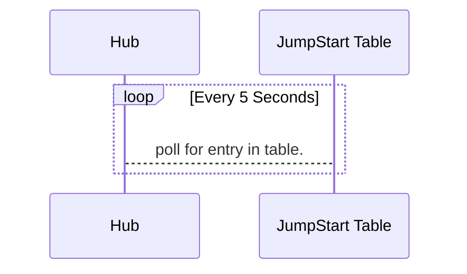

### Durable Task Framework Series
This post is part 3 of a series of posts on DTF.
1. [Durable Task Framework Internals - Part 1 (Dataflow and Reliability)](https://abhikmitra.github.io/blog/durable-task/)
2. [Durable Task Framework Internals - Part 2 (The curious case of Orchestrations)](https://abhikmitra.github.io/blog/durable-task-2/)
3. [Durable Task Framework Internals - Part 3 (Tracker Queue, Instance History and Jump Start)](https://abhikmitra.github.io/blog/durable-task-3/)

---

### The Tracker Queue 
in Part 1 I had discussed that DTF creates 3 queues in Service Bus (`Orchestrator`,`Worker` &`Tracking`). In the last 2 sections we discuused in depth about how these Orchestrator and Worker help run tasks durably.

The `tracking` queue is used for tracking events. In essence you can disable the tracking queue and the functionality would still work. Here is teh sequence diagram how various tracking messages are sent.


When the hub receives the event it puts the state into Azure Storage for tracking what all the states that the orchestration passed through. You can objectively see how many times the orchestration was triggered and the time take for each tasks to complete. Anyone using DTF in a non trivial way would need Azure Tables for the telemetry it provides.

### Azure Storage

Azure table store is completely optional for DTF. In fact if you do not pass the Azure Storage string , DTF will still work.In fact if you do not pass the Azure Storage , DTF optimises by not using the worker queue any more, as the events put into the tracker queue are going to result in a noop.

So when the framework boots up there are 2 Tables created in Azure Table Store.
- InstanceHistory00\<HubName\>
    - This stores the history of all the states that your TaskActivities and Orchestration passed through.
    - These are the same events that get queued in the tracker.
    - There are timestamps and sequence number to reconstruct the chronology of the various state transitions.
- JumpStart00\<HubName\>
    - This is used for added reliability since there is a chance of Dual writes. We will go into the details of this one.

### The JumpStart table

The table `JumpStart00\<HubName\>` is used for Jump starting orchestrations.
1. When the hub boots up , even before Client is started



2. When the **Client** encounters `CreateOrchestrationInstanceAsync` and Azure Storage connection strings provided, here is the flow that takes place


3. Now either of things can happen **Hub** encounters 
    - *Hub first gets the event from service bus , before it gets through polling* -  When it gets an entity from Jump start during polling , it checks whether the Orchestration corresponding to that specific row in Jump start table has already been kicked off. This can be figured out by looking at the tracker table . If it is able to find an entry in the tracker table , then there is no use of jump start and hence the entity is deleted.

    ```mermaid
    sequenceDiagram
    Orchestrator Queue-->>Hub: ExecutionStarted
    Note over Orchestrator Queue,Hub: The normal Orchestration <br/> process kicks off
    loop Every 5 Seconds
        Hub-->JumpStart Table: Finds an entry
    end
    Hub->>InstanceHistory Table: Checks if the Orchestration corresponding to the entry is present
    Hub->>JumpStart Table: Deletes the entry
    ```  
    - *Hub first gets the event from polling , before it gets through Service Bus* - When it gets an entity from the table , it first checks if there is a corresponding entry in tracker which would mean that Hub has received the orchestration signal from Service Bus.But in this case , it would not be able to find it, so it checks the time in which the client triggered the orchestration. If 10 minutes has not passed , it will ignore the entity , but **will not delete it**

    ```mermaid
    sequenceDiagram
    loop Every 5 Seconds
        Hub-->JumpStart Table: Finds an entry
        Hub->>InstanceHistory Table: Checks if the Orchestration corresponding to the entry is present
        Hub->>JumpStart Table: If currentTime - startTime < 10 minutes , no op.
    end
    note over JumpStart Table,Hub: Within 10 minutes , we will <br/> definitely receive the message from <br/> the queue
    Orchestrator Queue-->>Hub: ExecutionStarted
    Note over Orchestrator Queue,Hub: The normal Orchestration <br/> process kicks off
    Hub->>JumpStart Table: Deletes the entry
    ```  
4. Now lets look at the case where queing to Service bus fails from the client.

    ```mermaid
    sequenceDiagram
    Client->>JumpStart Table: Orchestration Details
    Client--xOrchestrator: Message Queuing failed 
    ```
    Now this might happen for a variety of reason , it could be a transient error or the client might have encountered an exception which caused the app to close. In a distributed system , its expected some nodes might go down.

    When this happens , DTF is an inconsistent state as the JumpStart Table indicates that a task has been scheduled but in reality , the message to Service bus has failed. This is a common problem with Distributed Systems and is called the [Dual Writes](https://thoughts-on-java.org/dual-writes/) issue. DUal writess leave you with a system with an inconsistent system.

    Thank fully when this happens , the jump start polling comes to the rescue.
    
    ```mermaid
    sequenceDiagram
    loop Every 5 Seconds
        Hub-->JumpStart Table: Finds an entry
        Hub->>InstanceHistory Table: Checks if the Orchestration corresponding to the entry is present
        Hub->>JumpStart Table: If currentTime - startTime < 10 minutes , no op.
    end
    note over JumpStart Table,Hub: After 10 minutes of waiting
    Hub->>JumpStart Table: Gets the entry from the jump start table & creates the message
    Hub-->>Orchestrator:ExecutionStarted
    Hub->>JumpStart Table: Updates the entity with the new timestamp
    Orchestrator-->Hub:ExecutionStarted
    Hub-->JumpStart Table: Finds an entry
    Hub->>InstanceHistory Table: Checks if the Orchestration corresponding to the entry is present
    Hub->>JumpStart Table: Deletes the entry
    ```  
    The Hub looks for situations where entity is present in Jump Start table but has not arrived through Service Bus for 10 minutes and then it queues the ExecutionStarted event  itself. It keeps repeating this process and trying to jump start the orchestration till it finds the orchestration in the tracker
5. The jump start is not a replacement for the Service Bus . Its only protecting against the dual write situation by becoming eventually consistent in case of a failure