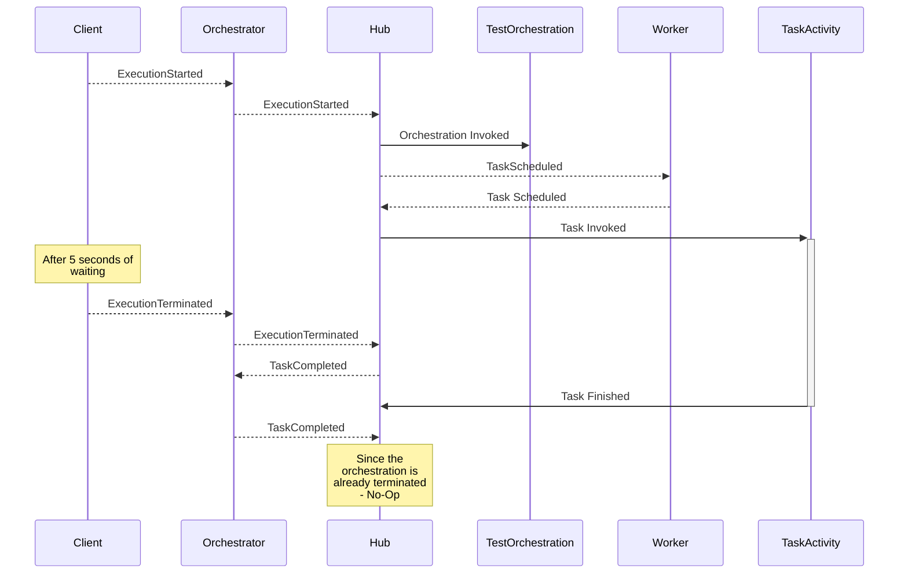

### Durable Task Framework Series
This post is part 3 of a series of posts on DTF.
1. [Durable Task Framework Internals - Part 1 (Dataflow and Reliability)](https://abhikmitra.github.io/blog/durable-task/)
2. [Durable Task Framework Internals - Part 2 (The curious case of Orchestrations)](https://abhikmitra.github.io/blog/durable-task-2/)
3. [Durable Task Framework Internals - Part 3 (Tracker Queue, Instance History, and JumpStart)](https://abhikmitra.github.io/blog/durable-task-3/)
4. [Durable Task Framework Internals - Part 4 (Cancelling Orchestrations & Middlewares-WIP)](https://abhikmitra.github.io/blog/durable-task-4/)

---

### Terminate an orchestration
The Client is able to control the orchestration even thouugh the orchestration itself is executed by the Hub. The client can issue `TerminateInstanceAsync` to terminate the ongoing orchestration.

```C#
    var instance = client.CreateOrchestrationInstanceAsync(typeof(TestOrchestration), "InstanceId5306", "Test Input").Result;
    Task.Delay(5000).Wait();
    client.TerminateInstanceAsync(instance);
``` 



So the terminate request is again sent as a message in the queue. The orchestrator gets the event and puts in the session state . 
Whenever the hub receives any event , it checks its existing list of events from the session state and builds up the current state.
So whenever the next set of events comes for the task completions, it will all result in a No-Op.