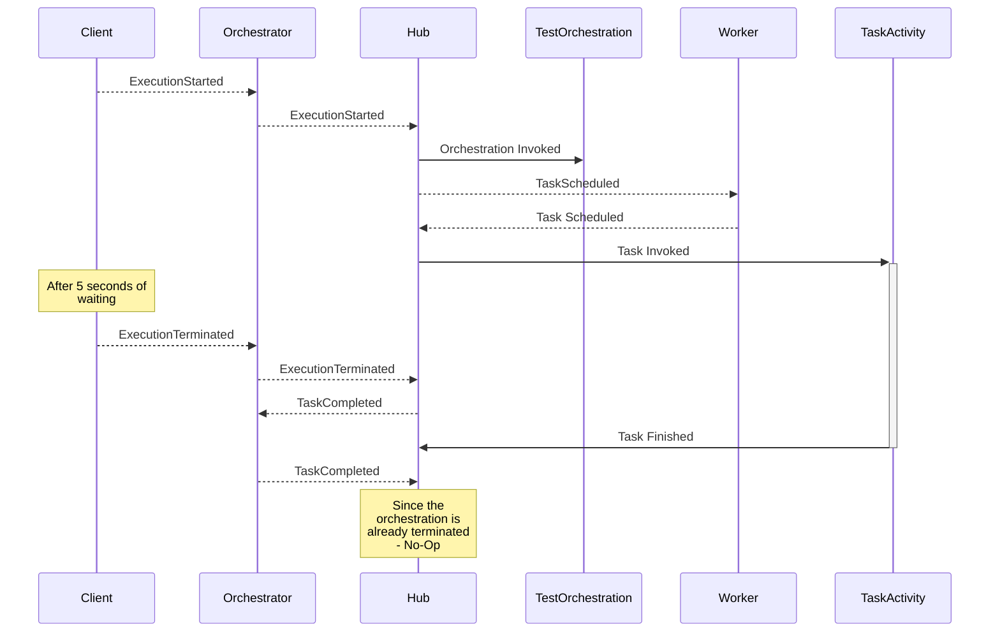
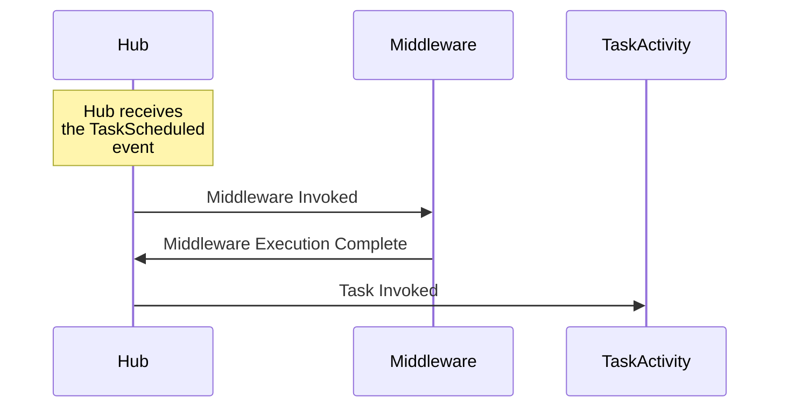
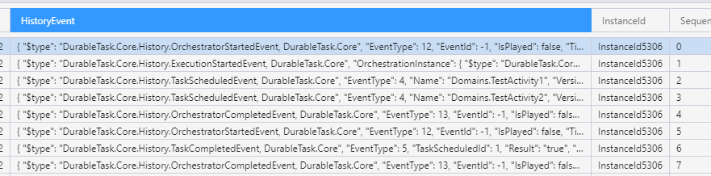

### Durable Task Framework Series
This post is **part 4** of a series of posts on DTF.
1. [Durable Task Framework Internals - Part 1 (Dataflow and Reliability)](https://abhikmitra.github.io/blog/durable-task/)
2. [Durable Task Framework Internals - Part 2 (The curious case of Orchestrations)](https://abhikmitra.github.io/blog/durable-task-2/)
3. [Durable Task Framework Internals - Part 3 (Tracker Queue, Instance History, and JumpStart)](https://abhikmitra.github.io/blog/durable-task-3/)
4. [Durable Task Framework Internals - Part 4 (Terminated Orchestrations & Middlewares)](https://abhikmitra.github.io/blog/durable-task-4/)
5. [Durable Task Framework Internals - Part 5 (Interesting usages of TPL in DTF)](https://abhikmitra.github.io/blog/durable-task-5/)
6. [Durable Task Framework Internals - Part 6 (Orchestration Execution Flow)](https://abhikmitra.github.io/blog/durable-task-5/)

Do you think there is more that I should cover or something I should fix ? Please raise an [issue](https://github.com/abhikmitra/blog/issues) and let me know.

---

### Terminate an orchestration
The Client can control the orchestration even though the Hub manages the orchestration. The Client can issue `TerminateInstanceAsync` to terminate the ongoing orchestration.

```csharp
var instance = client.CreateOrchestrationInstanceAsync(typeof(TestOrchestration), "InstanceId5306", "Test Input").Result;
Task.Delay(5000).Wait();
client.TerminateInstanceAsync(instance);
``` 


Here is the sequence diagram as to what happens behind the scenes



So the terminate request is again sent as a message in the queue. The orchestrator gets the event and puts it in the session state. 
Whenever the Hub receives an event, it checks its existing list of old events from the session state and builds up the current state.
So whenever the next set of TaskCompletion events, it will all result in a No-Op. The termination is asynchronous. There isn't any facility to cancel ongoing TaskActivities, and only new ones will not be triggered.


### Activity Middlewares 
The DTF Framework supports middlewares for plugging into the Activity and Orchestration execution flow. They are pretty simple to solve it and works how you would expect any middlewares to work.

```csharp

hubWorker.AddActivityDispatcherMiddleware((context, next) =>
{
    var activity = context.GetProperty<TaskActivity>();
    var instance = context.GetProperty<OrchestrationInstance>();
    Console.WriteLine("Activity Details - " + activity.GetType().ToString() + " Id = " + instance.InstanceId);
    return next();
});

```
The delegate that you pass to `AddActivityDispatcherMiddleware` is invoked just before the TaskActivity gets invoked


The middlewares get invoked in the same thread as Tasks, and they individually do not have any reliability. There is no state marker to show middleware was run successfully, but the Task failed. Middlewares get invoked for all tasks irrespective if the Task had failed in its previous run or not. It is agnostic to the Task triggering the middleware.

Also, the middleware cannot be used to handle task failures. You cannot put a try-catch around the `next()` call. The Exceptions thrown by the Task are caught and swallowed by the framework in the *TaskActivityDispatcher* part of the code, and the middlewares do not receive it.

#### Potential Gotcha!
Middlewares, if they fail, will fail the Task as well. Interestingly , such failures **do not trigger the `TaskFailed` event**. But since the TaskScheduled message is not removed from the queue, the Hub keeps retrying and gives up when the limit is reached. Since the TaskFailed event was not generated, Azure Table Storage would also not show that the Task had failed. 

Here is an example when one task completes, and others fail due to a failure in the middleware.  

The store has all the data about *Task1* till it was scheduled. One would be excused for thinking that *Task1* was never picked up, and there is something wrong with DTF.

What happened was, our middleware threw an exception when it was run in the context of *Task1*, but in other cases, it passed. Hence there is no data for *Task1* failing. This behavior is something to keep in mind when debugging the failures.


### Orchestration Middlewares 
```csharp

 hubWorker.AddOrchestrationDispatcherMiddleware((context, next) =>
{
    var orchestration = context.GetProperty<TaskOrchestration>();
    var state = context.GetProperty<OrchestrationRuntimeState>();
    var instance = context.GetProperty<OrchestrationInstance>();
    Console.WriteLine("\n   orchestration Details - " + orchestration.GetType().ToString() + " Id = " + instance.InstanceId + "state = " + state.Events.Count + "\n");
    return next();
});

```
Orchestration Middlewares work and behave the same way as the TaskActivity middlewares. The middleware gets invoked *each time* the orchestration gets invoked. Similar to activity middlewares a try-catch would not be able to catch exceptions from Orchestrations.