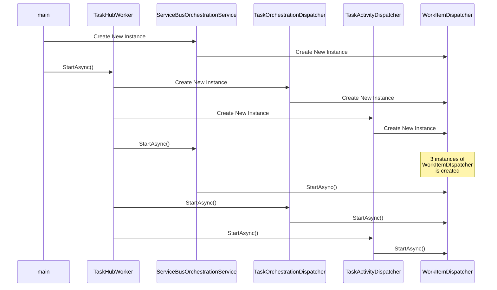
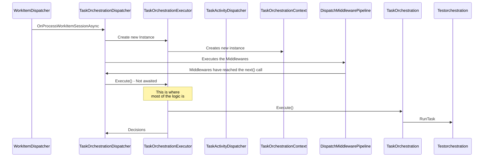

### Durable Task Framework Series
This post is **part 6** of a series of posts on DTF.
1. [Durable Task Framework Internals - Part 1 (Dataflow and Reliability)](https://abhikmitra.github.io/blog/durable-task/)
2. [Durable Task Framework Internals - Part 2 (The curious case of Orchestrations)](https://abhikmitra.github.io/blog/durable-task-2/)
3. [Durable Task Framework Internals - Part 3 (Tracker Queue, Instance History, and JumpStart)](https://abhikmitra.github.io/blog/durable-task-3/)
4. [Durable Task Framework Internals - Part 4 (Terminated Orchestrations & Middlewares)](https://abhikmitra.github.io/blog/durable-task-4/)
5. [Durable Task Framework Internals - Part 5 (Interesting usages of TPL in DTF)](https://abhikmitra.github.io/blog/durable-task-5/)
6. [Durable Task Framework Internals - Part 6 (Orchestration Execution Flow)](https://abhikmitra.github.io/blog/durable-task-5/)

Do you think there is more that I should cover or something I should fix ? Please raise an [issue](https://github.com/abhikmitra/blog/issues) and let me know.

---

In this post, we are going to go do a walk-through the code for DTF. This post would be helpful if you need to look under the covers. Instead of starting from scratch, you can go straight to the exciting part.

So whats happening here is , there are 3 interesting classes that get created
1. ServiceBusOrchestrationService - Monitors the tracker Queue
2. TaskOrchestrationDispatcher - Monitors Orchestrator Queue
3. TaskActivityDispatcher - Monitors Worker Queue

When you finally start the hub using `StartAsync`, all of these classes create their own  `WorkItemDispatcher` which is the starting point for all messages that your Receive.
WorkItem dispatcher has a while loop that keeps polling the respective QueueClient for new messages. So we have 3 WorkItemDispatchers polling three queues at regular intervals.
Whenever it gets any message, it creates a *new thread* and passes it off, back to the respective dispatchers

So the TaskOrchestrationExecutor is where most of the magic happens. It has multiple responsibilities.

1. Sets the SynchronizationContext
2. Checks the event history and uses it to build up the current state of the orchestration.
3. Figures out if the orchestration has already been terminated.
4. Has various functions for handling different types of Orchestration start cases like `TaskScheduled`, `TaskScheduled`, `SubOrchestrationInstanceCompleted` etc.
5. Handles Orchestration failures. 

When the TestOrchestration is invoked, all the calls to context (SchedulerWithRetry , timer, etc) get stored as an element in an array called decisions. The decision array is the messages that need to be put into the various Queues. The Dispatcher queues them back and marks the orchestration as complete.
This is the full flow right from the hub getting the message to executing it, figuring out the actions, and queueing them back.