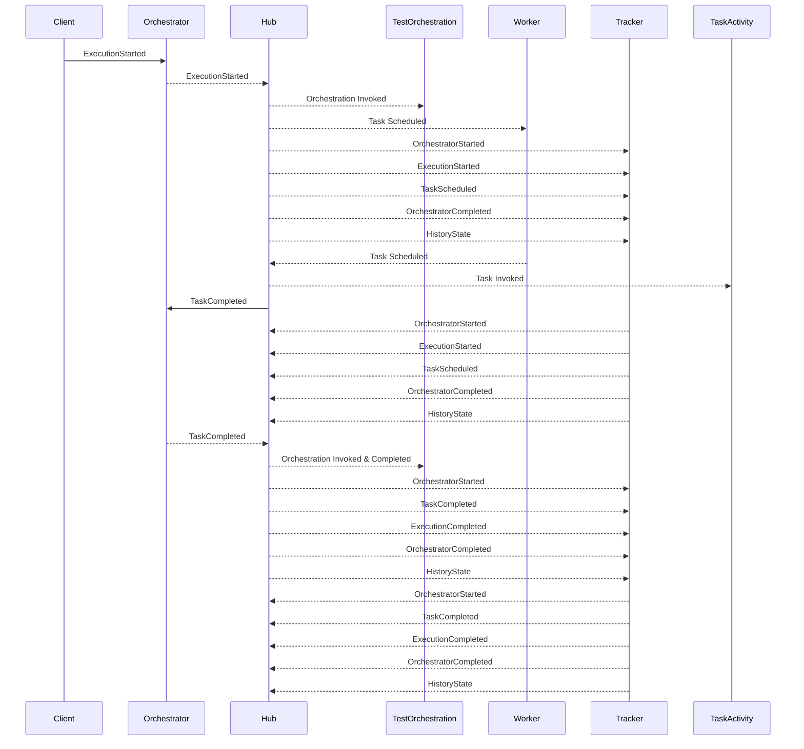

# Nice diagram
## check here
uakdjdna

```mermaid
sequenceDiagram
    Client->>Orchestrator: ExecutionStarted
    Orchestrator-->>Hub: ExecutionStarted
    Hub-->>TestOrchestration: Orchestration Invoked
    Hub-->>Worker: Task Scheduled
    Hub-->>Tracker: OrchestratorStarted
    Hub-->>Tracker: ExecutionStarted
    Hub-->>Tracker: TaskScheduled
    Hub-->>Tracker: OrchestratorCompleted
    Hub-->>Tracker: HistoryState
    Worker-->>Hub: Task Scheduled
    Hub-->>TaskActivity: Task Invoked
    Hub->>Orchestrator: TaskCompleted
    Tracker-->>Hub: OrchestratorStarted
    Tracker-->>Hub: ExecutionStarted
    Tracker-->>Hub: TaskScheduled
    Tracker-->>Hub: OrchestratorCompleted
    Tracker-->>Hub: HistoryState
    Orchestrator-->>Hub: TaskCompleted
    Hub-->>TestOrchestration: Orchestration Invoked & Completed
    Hub-->>Tracker: OrchestratorStarted
    Hub-->>Tracker: TaskCompleted
    Hub-->>Tracker: ExecutionCompleted
    Hub-->>Tracker: OrchestratorCompleted
    Hub-->>Tracker: HistoryState

    Tracker-->>Hub: OrchestratorStarted
    Tracker-->>Hub: TaskCompleted
    Tracker-->>Hub: ExecutionCompleted
    Tracker-->>Hub: OrchestratorCompleted
    Tracker-->>Hub: HistoryState
```