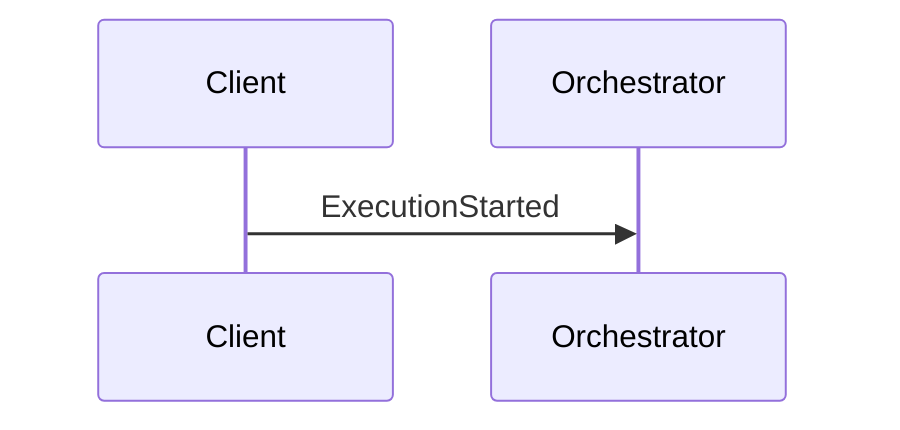
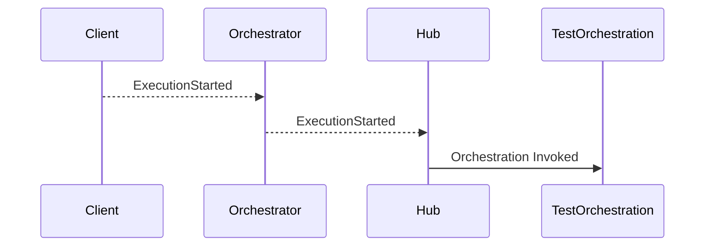
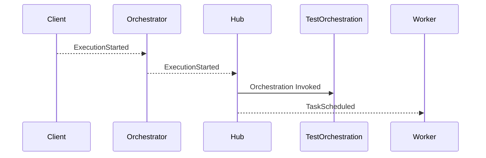
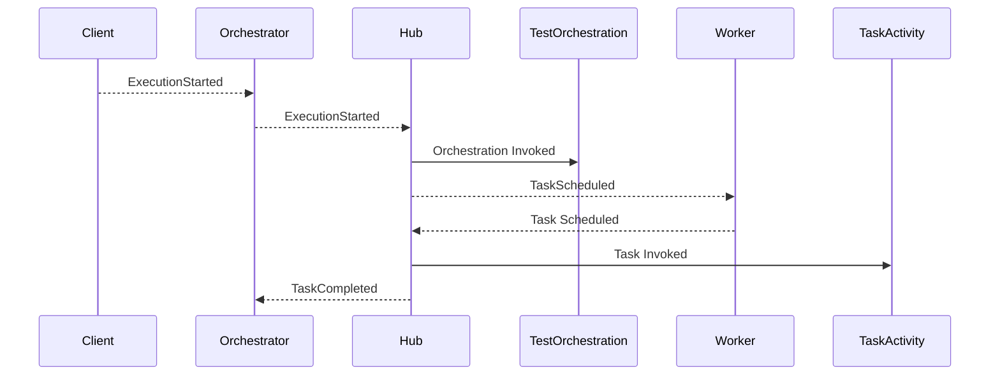
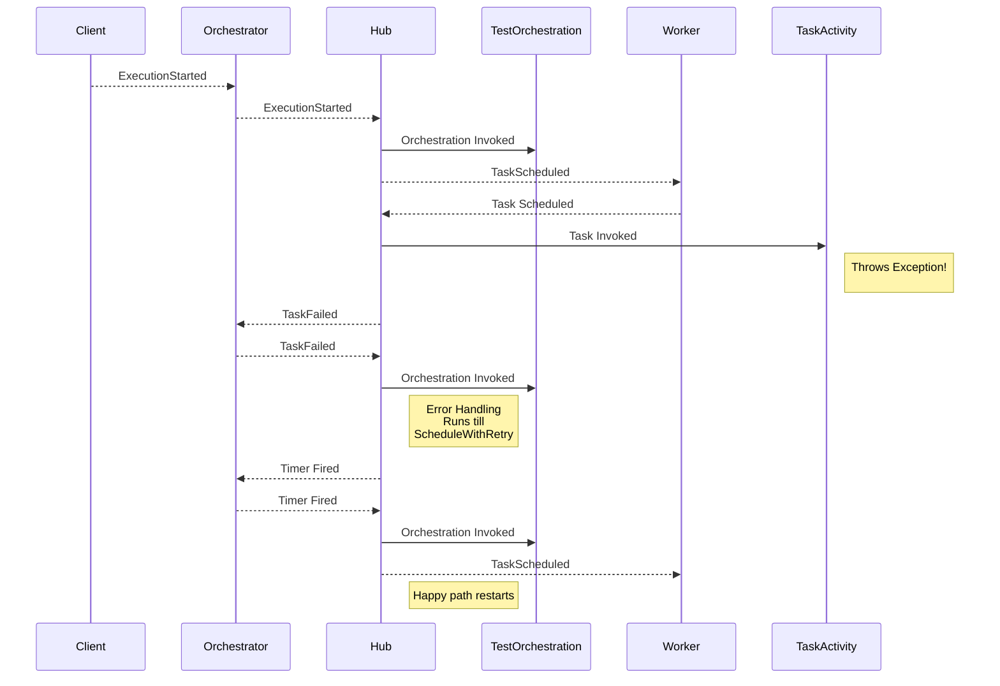

### Durable Task Framework Series
This is part 1 of a series of posts on DTF.
1. [Durable Task Framework Internals - Part 1 (Dataflow and Reliability)](https://abhikmitra.github.io/blog/durable-task/)
2. [Durable Task Framework Internals - Part 1 (The curious case of Orchestrations)](https://abhikmitra.github.io/blog/durable-task-2/)

---

### Durable Task Framework

The Durable Task Framework is an orchestration framework for dot net apps. You can read more about it in their official [github repo](https://github.com/Azure/durabletask). This [channel 9 video](https://channel9.msdn.com/Shows/On-NET/Building-workflows-with-the-Durable-Task-Framework) does a pretty good job of explaining about the framework.

While I was reading through the materials , I felt the literature out their treated the system as a blackbox and I couldn't find any material on the web on how does DTF works under the hood. So I cloned DTF repo and added console logs to understand how it works. The following details apply to [DurableTask.Core](https://www.nuget.org/packages/DurableTask.Core/) version 2.0.0.6 which maps to commit id `0a93eba6c9692f52776dac0f3741eccad3293ef6` in the DTF Github repo.

### Setup
My setup has 2 console apps , DTFDemoWorker and DTFClient. DTFDemoWorker houses the hubWorker and creates the resources. I have 1 Orchestration called a TestOrchestration which does 2 activities, testActivity1 and TestActivity2 both of which console logs to the console and waits for sometime to simulate some work being done.

You can find the repo [here](https://github.com/abhikmitra/DTFDemo) 

When we create the resources DTF creates 3 Queues in the Service Bus 
- \<TaskHubName\>/orchestrator
- \<TaskHubName\>/tracking
- \<TaskHubName\>/worker
. 

### Steps

We will see whats the process in which Orchestrator provides reliability. We will ignore the tracking Queue for now and add that later. To kepe the diagrams simple , let's assume we have 1 Task that gets invoked.

1. We start the process with the following code from the Client.
```C#
var instance = client.CreateOrchestrationInstanceAsync(typeof(TestOrchestration), "InstanceId5302", "Test Input").Result;
```
2. This will send a message with event name `ExecutionStarted` message into the Orchestrator queue.There will be other details such as the orchestration name and id , that will help DTF to operate on the correct instance of orchestration.



3. This is received by the hub & the actual [TestOrchestration](https://github.com/abhikmitra/DTFDemo/blob/master/Domains/TestOrchestration.cs) code is invoked. As you can see in the link above , I have put in log statements and 2 log statements are invoked.



4. Assume the orchestration code is as below. The orchestration runs till `scheduleWithRetry` and prints `Running Orchestration` into the console. Since this is the first time orchestration is running `Is replaying` is set to false. 
```C#
Console.WriteLine("Is Replaying =" + context.IsReplaying);
Console.WriteLine("Running Orchestration");
await context.ScheduleWithRetry<bool>(typeof(TestActivity1), options, "");
Console.WriteLine("Orchestration Finished");
return result; 
```
When the orchestration encounters an activity it puts a message into the Worker Queue and exits the orchestration. The rest of the orchestration is not executed.


5. The hub is also listening to the Worker Queue and picks up the `TaskScheduled` message and invokes the TaskActivity. For now,  let's assume all the TaskActivity does is a console log. So the task is immediately completed. When the task is completed the hub queues TaskCompleted event in the Orchestrator queue.

6. The Orchestration wakes up, the moment the hub detects a message in the Orchestrator Queue and *restarts the Orchestration from the beginning*. So all the logs that got printed last time gets printed again. Since this is the second time orchestration is running `Is replaying` is set to *True*.

 ```mermaid
sequenceDiagram
    Client-->>Orchestrator: ExecutionStarted

    Orchestrator-->>Hub: ExecutionStarted

    Hub->>TestOrchestration: Orchestration Invoked
    Hub-->>Worker: TaskScheduled
    Worker-->>Hub: Task Scheduled
    Hub->>TaskActivity: Task Invoked
    Hub-->>Orchestrator: TaskCompleted
    Orchestrator-->>Hub: TaskCompleted
    Hub->>TestOrchestration: Orchestration Invoked & Completed
```

7. What happens when the the Hub fails in Step #5 while it is running the taskActivity ?
    - In a distributed system , we have to work with the assumption that the hub can fail any time and so can the task. 
    - The hub does not remove the TaskScheduledEvent unless the TasActivity is complete. So if in case the hub goes down, the service bus message will be present in the queue. When the hub comes back online, it will start from step 5 as if nothing had happened.

8. What if, the Task itself throws an exception  ? 


9. How does DTF remember the results of each task Activity ?

    -  DTF serializes all the events into orchestration messages (Session State) that it puts in service bus. For eg,  all of the tasks are serialized into messages.
