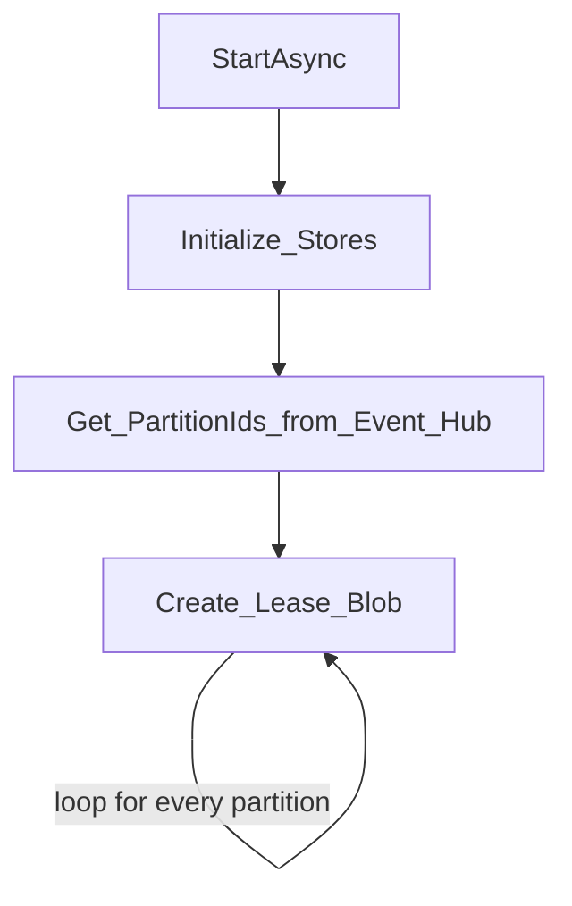

## Azure Event Hub SDK Series
This post is **part 1** of a series of posts on Azure Event Hub SDK for Dot NET.
1. [Azure Event Hub SDK Internals - Part 1 (Overview & Control Flow)](https://abhikmitra.github.io/blog/event-hub/)
2. [ Azure Event Hub SDK Internals - Part 2 (Partition Manager & Lease Management)](https://abhikmitra.github.io/blog/event-hub-2/)

Do you think there is more that I should cover or something I should fix ? Please raise an [issue](https://github.com/abhikmitra/blog/issues) and let me know
---

In this section we will deep dive into the [Partition Manager](https://github.com/Azure/azure-sdk-for-net/blob/5e30a0ca3873d54a310924925e35043dd9f3b6a0/sdk/eventhub/Microsoft.Azure.EventHubs.Processor/src/PartitionManager.cs) in the Event Hub SDK. This is the part that has some of the business logic of the receiver built-in. Partition Manager is responsible for initializing the stores and managing the leases of the partition.

## Control Flow

The control flow in the Partition Manager can be divided into 2 distinct parts.
1. Initialization Flow - In this flow partition managers initializes all the stores and get everything ready for receiving messages. This flow ends when the control flow is returned to `RegisterEventProcessorAsync`.
2. RunAsync Flow - As the name suggests, this is an asynchronous & long-running operation that triggers the `SimpleEventProcessor` and make sure the processor keeps receiving the messages

### Initialization flow

- It initializes the stores. The Partition Manager checks if the lease-store and the checkpoint store exists.
- If they are not present it creates the appropriate Container in the Azure Blob Storage.
- Once the containers are created, we get the partition info from the event hub.
- Then we create `Leases` in the store. These are just blobs that have all the information needed to receive events.
- For each partition there will be 1 Lease Blobs.
- It also initializes the Checkpoint store and checkpoints which internally is the same as leases.
- In the current implementation a Checkpoint blob and the lease blob are one and same. The same blob represents both checkpoints and leases ownership.

### RunAsync Flow

- This flow keeps looping until cancellation is requested by calling UnregisterEventProcessorAsync.
    - Renew owned Lease
    - Check and Grab Expired/New Leases
    - Steal leases if it is not load-balanced.
    - Create or update pumps based on Leases.
- In case there is an error or unregister has been called, it removes all the pumps.

## Lease Management
This is the most interesting aspect of the SDK on how it manages the leases. To understand lease management, we  will divide it into 3 parts

1. Check and Grab Expired/New Leases
2. Renew owned Leases - Leases that are already owned by the current host
3. Steal Leases

To understand how leases work in Azure Blobs, it will be good to read this [article](https://www.red-gate.com/simple-talk/cloud/platform-as-a-service/azure-blob-storage-part-8-blob-leases/). The leasing mechanism of event hub is built on Azure Blobs.
Some of the points to remember are

- The lease on a blob can be acquired when the lease is in any state other than `Leased`
- Once the Lease is acquired, the Azure blob SDK returns a token.
- This token is like a key, whoever possesses the token can operate on the blob.
- If one host gives their token to another host, the new host can call `ChangeLeaseAsync` to acquire a new lease for itself.
- The previous host loses the lease.

### Grab expired leases

When we first start the Event hub Receiver and create the lease blobs. The leases have no owner. This part of the code is responsible for taking up expired as well as new leases.

Get capacity of the host

- Before the Partition manager can start acquiring new leases it needs to check the ideal lease per host.
- It can figure out the active hosts by simply iterating over the lease blobs which are not expired.
- Then the ideal leaser host should be `number_of_lease_blob/number_of_active_hosts`. Let's call this number `leaserPerHost`
- Based on the existing leases that it already has, the number of leases the partition manager can own is `leaserPerHost-leasesWeAlreadyOwn`, lets call this number `targetLeaseCount`
- If the `targetLeaseCount` is negative , its a no-operation. 

Grab Expired/New Leases
- Partition Manager starts iterating through the lease blobs and whenever it finds any expired blobs
    - It re-fetches the blobs to see its latest status.
    - If the lease is not acquired by some other host
    - It makes an `AcquireLeaseAsync` call on the lease blob. It passes a lease Id and the lease duration is set to 30 seconds.
    - Then it modifies the lease blob's metadata. 
        - It the `OWNINGHOST` to the current host id in the metadata    
    - It modifies the lease blob's content. 
        - It sets the `Owner` to the current host id 
        - It sets the `Token` to the token returned by the Azure blob.
- This entire process happens parallelly for the leases. As in if targetLeaseCount is 4, the code tries to get 4 leases parallelly.
- There is a possibility of race condition, so it re-queries the blob for its lease status. If the lease gets owned by some other host in between the code, it skips that lease and does not try to get access forcefully.

### Renew leases
This part of the code deals with renewing leases for the leases which were already owned by the host. The code iterates through all the leases and figures out the ones that are owned by the current host.

- For each of the lease that is owned and not expired, Partition Manager queries the pumps to find an existing token.
- The token would mean that at some point we had the lease to the leaseBlob.While it is possible to query the leaseBlob text to get the token, getting it from in-memory guarantees that Partition Manager is not stealing some other Host's lease.
- It uses the lease token to call into Azure Blob and renew the lease.
- If there is an exception, no retry is made. The in-memory lease array is marked appropriately to signify that the lease has been lost.

### Steal Leases
This section only deals with leases that are owned by other hosts. If a leased blob does not have an owner, this section will not act on it.

Finding a lease that can be stolen.

- We create a `countsByOwner` map, which has the count of leases per host
- We find the biggest owner who has the most number of leases.
- The [docs in the code](https://github.com/Azure/azure-sdk-for-net/blob/5e30a0ca3873d54a310924925e35043dd9f3b6a0/sdk/eventhub/Microsoft.Azure.EventHubs.Processor/src/PartitionManager.cs#L641) do a good job of explaining how the code decides which leases to still.
- The most important line here is 
    > In either case, if the difference between this host and the biggest owner is 2 or more, then the system is not in the most evenly-distributed configuration, so steal one lease from the biggest.
- So based on `(biggestOwner.Value - haveLeaseCount) >= 2` we find `one` lease that we can move. This is **not parallel**, only one lease can be moved at a particular time.

Once the above code finds a lease, it starts the process of stealing the lease. 
- It checks if the lease was stolen by some other host. If it was stolen then we do no act on it.
- Refresh the lease and checks if it is not expired or ownership has already changed. as in the lease is stolen by someone else.
- Then we acquire the lease using the **token that was present in the blob**.
- The code calls into `ChangeLeaseAsync` using the token present in the blob to switch over the lease and generate a new token. 
- The previous host now loses access to the lease.

