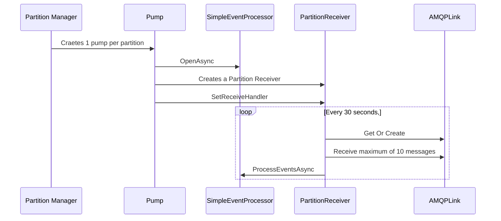

## Azure Event Hub SDK Series
This post is **part 3** of a series of posts on Azure Event Hub SDK for Dot NET.
1. [Azure Event Hub SDK Internals - Part 1 (Overview & Control Flow)](https://abhikmitra.github.io/blog/event-hub/)
2. [Azure Event Hub SDK Internals - Part 2 (Partition Manager & Lease Management)](https://abhikmitra.github.io/blog/event-hub-2/)
3. [Azure Event Hub SDK Internals - Part 3 (Pumping Data & AMQP Links)](https://abhikmitra.github.io/blog/event-hub-3/)

Do you think there is more that I should cover or something I should fix ? Please raise an [issue](https://github.com/abhikmitra/blog/issues) and let me know.

---

In this section we will deep dive into the [Event Hub Partition Pump](https://github.com/Azure/azure-sdk-for-net/blob/6a73a945124f1e268a86d62a0e2ea5b4bd31c496/sdk/eventhub/Microsoft.Azure.EventHubs.Processor/src/EventHubPartitionPump.cs) in the Event Hub SDK. This is the part that deals with getting the actual data from the Event Hub.

## Control Flow

The control flow starts in the partition Manager. Once the SDK has the proper leases to the partitions, it starts creating or updating the Partition Pumps.
- For every partition that is leased by the current host
    - It checks and create pumps if necessary.
- For every partition that is **not** leased by the current host
    - We remove the pumps.

## Creating Pumps
The partition manager keeps a map of partition id to pumps. . Every turn of the loop, the Partition manager renews/gets new leases and checks if the new pump needs to be created based on the `partitionId-Pump` map. So every PartitionId can have at most 1 pump.

### Opening the Pump
- Each partition will have its Partition Pump
- After a pump is created its `opened` asynchronously
- It is in this step that an instance of the `SimpleEventProcessor` is created. Its a singleton, so only the first pump creates the instance, all pumps share the same instance.
- Then the pump calls into `OpenAsync` of `SimpleEventProcessor` and awaits it.
- Once `SimpleEventProcessor` returns we get the checkpoint information from the Lease Blob. The checkpoint is a combination of the Offset and Sequence Number.
- If there is no checkpoint information for that partition, we set the initial offset to -1
- Then we create the Partition Receiver which completes the opening of the pump. We set the pump status to Running.

### Running the Pump
- Once the pump is marked as running, the code calls into  `AmqpPartitionReceiver` and sets the receiver which is just a callback into the Pump.
- This triggers the `PartitionReceiver` which starts polling the event hub asynchronously.
- The Partition receiver stops listening when the pump sets the ReceiveHandler to null.
- The receiver bit of the code can be seen [here](https://github.com/Azure/azure-sdk-for-net/blob/3db8feaa87d7e44eb91baf7812edb70fbc8042ad/sdk/eventhub/Microsoft.Azure.EventHubs/src/Amqp/AmqpPartitionReceiver.cs#L276).
- The Partition Receiver runs a while loop till the point it has an active ReceiveHandler.
- - The partition receiver creates a `ReceivingAmqpLink` that reads the offset from the blob store and creates filters that look like queries - `amqp.annotation.x-opt-offset > 14832`. This is a singleton the AMQP layer will create this once and keep the link alive.
- The receiver uses the link to wait for messages for a maximum of 30 seconds after which it restarts the loop and does the health checks on the pump.
- The link to the event hub does not get destroyed and is always on.
- In each iteration it gets data from the event hub, transforms it into `EventData`, and invokes `ProcessEventsAsync` of the simpleEventProcessor.
- The Pump stores the Sequence number, enqueued time, and retrieval time. The epoch is also set

The overall flow looks like this.

Though it looks like a poll, in essence what the code is polling is the Link which is persistent across all iterations. The code awaits and asks for the messages from the event hub. Once it gets a batch of messages, it quickly **processes** it by sending it to the `SimpleEventProcessor` and gain comes back to process more. If there are no messages, it simply waits for a minute and continues with the next iteration.