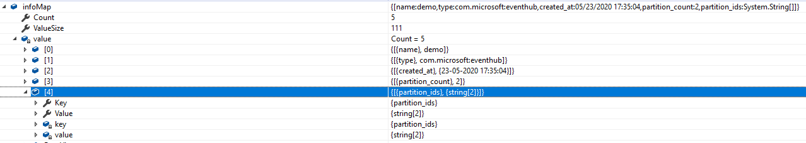
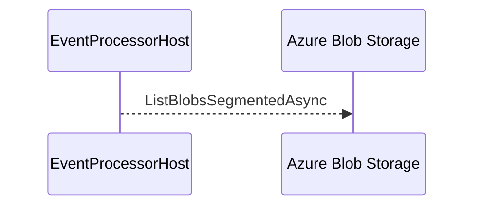
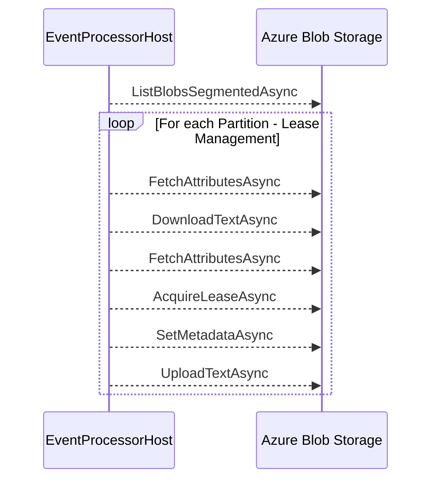
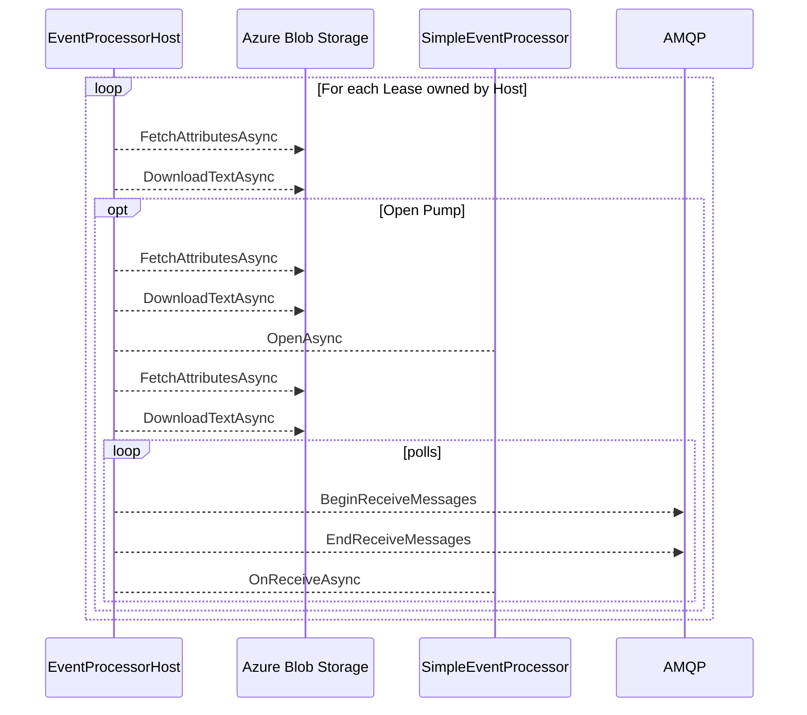

## Event Hub SDK Internals


Azure Event Hubs is a big data streaming platform and event ingestion service. It can receive and process millions of events per second. Data sent to an event hub can be transformed and stored by using any real-time analytics provider or batching/storage adapters. You can read more about Event Hubs [here](https://docs.microsoft.com/en-us/azure/event-hubs/event-hubs-about)

### Event processor 
We will start with the Event Hub Processor. There are 4 steps to receiving an event and we will dive into the details of each of the areas.

#### RegisterEventProcessorAsync - Initialization

Here is a typical code that you would use for registering an event processor.

```csharp
var eventProcessorHost = new EventProcessorHost(
                EventHubName,
                PartitionReceiver.DefaultConsumerGroupName,
                EventHubConnectionString,
                StorageConnectionString,
                StorageContainerName);

// Registers the Event Processor Host and starts receiving messages
await eventProcessorHost.RegisterEventProcessorAsync<SimpleEventProcessor>();
```
Here is what happens as a part of the registration.

- An Azure Storage CloudBlobClient is created with max execution time of 2 minutes.
- The PartitionManager is started which initializes the blob store.
- As a part of the initialization, first, it checks if the container exists.
- If not it will create the Azure blob container.
- Then it gets the run time information through an AMQP request to the Event Hub.
- The run time information has the partition count and partition ids.
- The response of the AMQP request looks like 
- It extracts the Partition Ids and then create the leases for each of the partitions.
    - The blobs get created under `<containername>/$Default/<PartitonName>`
    - The blob contents are 
        ```json
            {
                "Offset":null,
                "SequenceNumber":0,
                "PartitionId":"0",
                "Owner":"",
                "Token":"",
                "Epoch":0
            }
        ```
- Verify the checkpoint store exists. In this library checkpoints store is same as the lease store. So checkpoint operations turn into lease operations under the covers. Read the comment in the code [here](https://github.com/Azure/azure-sdk-for-net/blob/5e30a0ca3873d54a310924925e35043dd9f3b6a0/sdk/eventhub/Microsoft.Azure.EventHubs.Processor/src/AzureStorageCheckpointLeaseManager.cs#L106)
- Similar to leases, it checks for the existence of checkpoints. Since it is the same as leases, it is marked as a no-op.

```mermaid
sequenceDiagram
    Main()->>EventProcessorHost: RegisterEventProcessorAsync
    EventProcessorHost-->>Azure Blob Storage: Check If Container Exists for leases
    EventProcessorHost-->>EventHub: AMQP: Gets Runtime Information 
    loop For each Partition
        EventProcessorHost-->>Azure Blob Storage: Create Lease for Partition 0
        EventProcessorHost-->>Azure Blob Storage: Create Lease for Partition 1
    end
    EventProcessorHost-->>Azure Blob Storage: Check If Container Exists for Checkpoints
    EventProcessorHost->>Main(): Return
```
Initialization is now complete.
Kicks off the run Async Processor and returns **without** waiting for RunAsync to complete

#### RegisterEventProcessorAsync - Run Async
As mentioned above, RunAsync part of the process is done asynchronously after RegisterEventProcessorAsync returns.
- The library checks the `$Default` blob directory and gets all the leases.
- It tries to renew downloaded leases

Then start the lease management process. As a part of lease management, the Partition Manager downloads the Lease Blob, rechecks, and then acquires the lease. Sets the owner to the current hostId uploads it back




For each Lease that is owned by the host, Partition Manager creates a Pump. The pump is responsible for querying the event hub for messages and pushing it to the subscriber

- Refresh the Blob again so that we get the latest and check the hostname and check its expiry.
- If everything looks alright we create the pump
- We open the Pump using Open Async
- Then pump fetches the lease blob and checks for offset.
- The pump keeps checking for messages and keeps pushing them to the Event Processor



Overall there are 3 sections in Azure Event Hub

1. Partition Manager - This takes care of Lease Management & Creation of Pumps 
2. Event Hub Partition Pump - This is responsible for pushing the events to the Event Processor
3. AMQPPartitionReceiver - THis handles the AMQP side of things when receiving a message.

