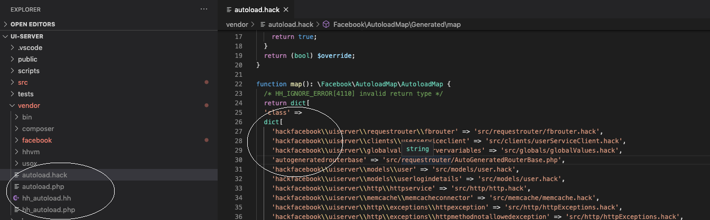
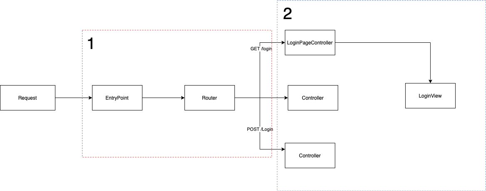
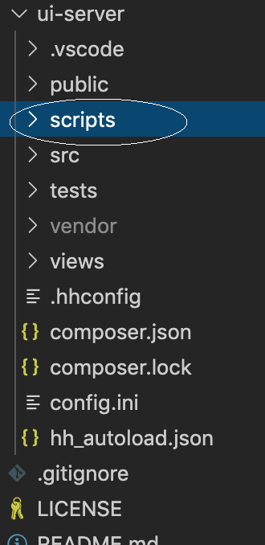

## Web Server in Hack 

When I started learning Hack, one of the problems I ran into was the lack of Open Source projects(Web Servers) in Hack. I was not able to find examples or a guide on how to set up a barebones web server. This post will breakdown the process of getting started building a small webserver. This assumes that you know the syntax and the concepts. The documentation is great when it comes to explaining the features of the language, so that's out of scope for this post. 

The completed project can be found [here](https://github.com/abhikmitra/hack-memcache-mysql-web-server) 

Do you think there is more that I should cover or something I should fix? Please raise an [issue](https://github.com/abhikmitra/blog/issues) and let me know.

---

Before starting hack, I had worked majorly on Typescript (Javascript), C#, and Java. If you have worked on those languages, this post will be more relevant as I draw a comparison with those stacks.

**Disclaimer** - This post was a part of my Learning exercise, this should not be taken as best practice or the correct way to write code in Hack. If you are also trying to get your hands dirty with [hacklang](https://hacklang.org/), this should be useful

### Setting up the repo

Before you start, I am assuming you have already gone through the Official [Getting Started](https://docs.hhvm.com/hack/getting-started/getting-started) tutorial.

#### Autoload

This was a new concept for me. In NodeJs we explicitly require the files and the engine travels the interpreter and loads all the files. In C#, including files was never a problem since the IDE generates the project & solution files. In Hack, you can go the "require each file" route but configuring Autoloader is the best practice. So you need to create a `hh_autoload.json`. Steps are detailed [here](https://docs.hhvm.com/hack/getting-started/starting-a-real-project).

Now the file itself insufficient for the hack interpreter to autoload everything. There are two more steps that you need to be aware of. Firstly, when you add anything to composer.json the autoload files are generated inside the vendor folder as shown below  

 

The autoload file is simply a huge dictionary that has a mapping between the class name(including the namespace) and their corresponding path. So when you use `use HackFacebook\UiServer\Http` statement, the interpreter checks this file to figure out the actual location of the hack file. So you need to make sure this is updated, especially when you add new files or move stuff around.
The Hacklang doc says to use `vendor/bin/hh-autoload` to regenerate the map. I used `composer dump-autoload` to regenerate the file and it worked fine.

#### Composer
Composer is the PHP package management solution. If you are coming from Nodejs background, this is exactly like NPM with its `package.json`(composer.json) and `package-lock.json`(composer.lock) so no surprises there.

#### hhconfig
You would need a `hhconfig` file. The [one I used](https://github.com/abhikmitra/hack-memcache-mysql-web-server/blob/master/ui-server/.hhconfig) was also pretty barebones. Before you can use FixMe codes to override the hh_client errors you need to declare the allowed fixme_codes in the config. this is a recent change in June 2020. You can read more about this change [here in HHVM releases](https://hhvm.com/blog/2020/06/16/hhvm-4.62.html).

#### config

You would need a [config.ini](https://github.com/abhikmitra/hack-memcache-mysql-web-server/blob/master/ui-server/config.ini). It will have a config for your web server. Could be any name, you need to specify when you start your server.

#### Debugging & Development

I used the [vscode-hack](https://github.com/slackhq/vscode-hack) by Slack. It only works if the root is a Hack project. For example, if you open the top-level folder in the [repo](https://github.com/abhikmitra/hack-memcache-mysql-web-server) through VScode the plugin won't work. But instead, if you open the [ui-Server](https://github.com/abhikmitra/hack-memcache-mysql-web-server/tree/master/ui-server , the plugin will work and you should be able to see red squiggly lines for errors.
So if you are starting on a hack project, make sure the root that you open in VS code has the hhconfig,hh_autload, and vendor. 

Also, to get type errors in VS code you need to have hh_client daemon running. starting it is simple 

```
hh_client start
```
Sometimes I saw it git frozen or the hints not working properly. A simple restart of the hh_client fixed the problem.

So now you all you need is to add an [entry point](https://docs.hhvm.com/hack/getting-started/starting-a-real-project) and you should have a basic scaffolding for some Hack code. You can find the finished scaffolding [here](https://github.com/abhikmitra/hack-memcache-mysql-web-server/tree/master/scaffolding-generic)


### Creating the Webserver

Now that we have a functioning repo setup, let's look at how to create a web server.
The overall request flow looks like this. If you are from an `ASP.NET` background the #1 part will look strange to you as that is something that the Framework takes care of and not something you think of.
 
Another strange aspect was the router setup encourages that each controller only handles one action. So the same controller cannot handle multiple requests.

#### Request Routing

Here the framework itself does not do any routing and the user needs to be explicit about the routing. That is what Facebook has come up with a `CodeGen` that generates the code for a router. Codegens seemed to be pretty common in the Hack ecosystem. That is why it is fairly common to have a scripts folder
 

So to use the [hack router codegen](https://github.com/hhvm/hack-router-codegen), you need to create a file and provide the following details to your code gen
- Location of controllers
- Controller base Interface - This is how the codegen finds which classes are controllers and which are not.
- The name and the filename 

Once you run the Codegen, you will have something that looks like this.

```hack
abstract class AutoGeneratedRouterBase
  extends \Facebook\HackRouter\BaseRouter<classname<\HackFacebook\UiServer\Controllers\IRoutableController>> {

  <<__Override>>
  final public function getRoutes(
  ): ImmMap<\Facebook\HackRouter\HttpMethod, ImmMap<string, classname<\HackFacebook\UiServer\Controllers\IRoutableController>>> {
    $map = ImmMap {
      \Facebook\HackRouter\HttpMethod::GET => ImmMap {
        '/' => \HackFacebook\UiServer\Controllers\Pages\HomePageController::class,
        '/login' =>
          \HackFacebook\UiServer\Controllers\Pages\LoginPageController::class,
        '/signUp' =>
          \HackFacebook\UiServer\Controllers\Pages\SignUpPageController::class,
      },
      \Facebook\HackRouter\HttpMethod::POST => ImmMap {
        '/login' =>
          \HackFacebook\UiServer\Controllers\API\LoginPostController::class,
        '/signUp' =>
          \HackFacebook\UiServer\Controllers\API\SignUpPostController::class,
      },
    };
    return $map;
  }
}
```

This is simply a map of the route and the class. You can handroll this too using Facebook's [HackRouter](https://github.com/hhvm/hack-router) . The way the router figures out this mapping is through the interfaces that the controller implements. For example, if the class implements `Facebook\HackRouter\SupportsGetRequests` that means the class will be used to get calls. Similarly, each controller needs to override `getUriPattern`  for the codegen to understand which route does this controller serve.

#### Controllers and Views

We will now talk about Part 2 of the section.  

The way the controllers are structured in the [example repo](https://github.com/abhikmitra/hack-memcache-mysql-web-server/tree/master/ui-server/src/controllers) 
Controllers are separated in 2 folders
 - API
    - Can be Get or Post
    - Does not return a view
 - Pages
    - Can only be GET
    - Is associated with a view

I am not sure of the best practice here, I came up with the model based on how the code in HHVM doc site is structured. One of the idiosyncrasies of hack is that code containing XHP cannot be namespaced. 

Now, I love namespaces and also the separation between view and logic. I tried to emulate the NodeJs model where we have controllers and the HTML view completely separate. I couldn't find data on what exactly is the best practice here so I came up with the view controller separation.

**Controller** - Has the business logic and is bound to view using the getView method that all Page controllers need to implement. This also allows controllers to be namespaced as there is no XHP here.

**Views** - Has the XHP and they can have different inheritance hierarchy for complex layouts, very similar to how Jade/ views work in Node.JS.

You could choose a different model for your app. There is no restriction from the router/framework side.

### Handling Globals
There are quite a few global values that you may need. The way I accessed them was to have separate `globals.hack` which was typed and would get data off the globals. That way I could control the `FixMe` proliferation and limit it to only 1 file. Also, I used this library called `usox/hackttp` which allows us to create a Server request using
```hack
$request = \Usox\HackTTP\create_server_request_from_globals();
```
without having to access the global variables. 

You can see the completed project [here](https://github.com/abhikmitra/hack-memcache-mysql-web-server). I have put all the setup details in the readme. Should be fairly straightforward. Let me know what I should have improved in this scaffolding or if there is a gap in my understanding that I need to fill.